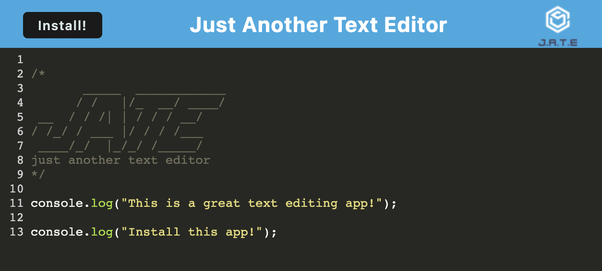

# Just Another Text Editor

## Table of Contents:

- [Description](#description)
- [Usage](#usage)
- [Installation](#installation)
- [Deployed Application](#deployed-application)
- [GitHub Repo](#github-repo)
- [Screenshots](#screenshots)
- [Questions](#questions)

## Description

JATE is a text editor that allows you to write code using your web browser.

## Usage

JATE stores data and can even be run while offline. This application can be installed as a Progressive Web Application with a shortcut directly from your Desktop.

## Installation

Simply visit the deployed link, and you are ready to start editing your code in the web browser.

## Deployed Application

https://text-editor-mf.herokuapp.com/

## GitHub Repo

https://github.com/mfandel118/Text-Editor

## Screenshot(s)

## Questions

Any additional questions about this project? Please feel free to reach out:

Marissa Fandel

- Email: mfandel118@gmail.com
- GitHub: https://github.com/mfandel118
